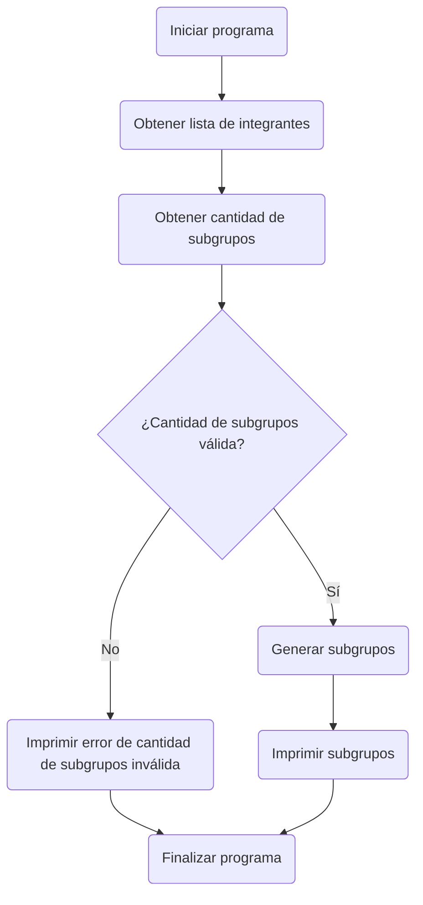

# A first-level heading
## A second-level heading
### A third-level heading


```javascript
function test() {
  console.log("notice the blank line before this function?");
}
```


```mermaid
graph TD
    A(Iniciar programa) --> B(Obtener lista de integrantes)
    B --> C(Obtener cantidad de subgrupos)
    C --> D{¿Cantidad de subgrupos válida?}
    D -- No --> E(Imprimir error de cantidad de subgrupos inválida)
    E --> F(Finalizar programa)
    D -- Sí --> G(Generar subgrupos)
    G --> H(Imprimir subgrupos)
    H --> F(Finalizar programa)
```