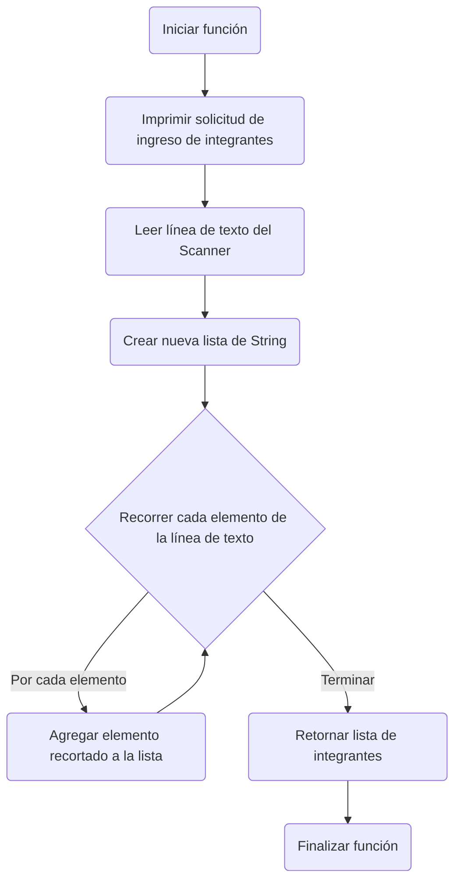

# A first-level heading
## A second-level heading
### A third-level heading


```javascript
function test() {
  console.log("notice the blank line before this function?");
}
```


```java
private static List<String> obtenerIntegrantes(Scanner scanner) {
    System.out.print("Ingrese la lista de integrantes separados por coma: ");
    String inputIntegrantes = scanner.nextLine();
    List<String> integrantes = new ArrayList<>();
    for (String integrante : inputIntegrantes.split(",")) {
        integrantes.add(integrante.trim());
    }
    return integrantes;
}
```

